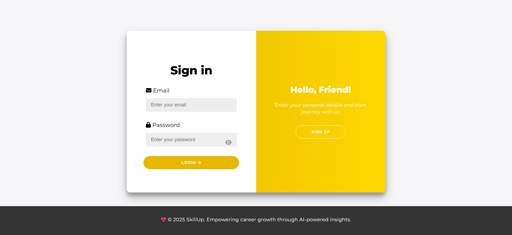

# Skill UP - Backend

Skill UP is a web application designed to provide personalized recommendations for courses, videos, and job openings based on user inputs. This repository contains the backend code for the application, built using **Flask** and **MongoDB**.

---

## Table of Contents

1. [Features](#features)
2. [Prerequisites](#prerequisites)
3. [Setup](#setup)
4. [Running the Backend](#running-the-backend)
5. [Running MongoDB](#running-mongodb)
6. [Deployment](#deployment)
7. [Contributing](#contributing)
8. [License](#license)
9. [Contact](#contact)
10. [Screenshots](#screenshots)

---

## 1. Features&#x20;

- **Course Recommendations**: Suggest courses based on user skills and interests.
- **Video Recommendations**: Recommend educational videos tailored to user preferences.
- **Job Openings**: Provide job openings based on user skills and location.
- **Personalized Roadmap**: Generate a step-by-step roadmap for skill development.
- **Multilingual Support**: Translate content into multiple languages.

---

## 2. Prerequisites&#x20;

Before running the application, ensure you have the following installed:

- **Python 3.8+**: [Download Python](https://www.python.org/downloads/)
- **Node.js**: [Download Node.js](https://nodejs.org/)
- **MongoDB**: [Download MongoDB](https://www.mongodb.com/try/download/community)
- **Git**: [Download Git](https://git-scm.com/downloads/)

---

## 3. Setup&#x20;

1. **Clone the Repository**:

   ```bash
   git clone https://github.com/your-username/skillup-backend.git
   cd skillup-backend
   ```

2. **Install Python Dependencies**:

   ```bash
   pip install -r requirements.txt
   ```

3. **Install Node.js Dependencies**:

   ```bash
   cd skillup-backend  # Make sure you are in the project directory
   npm install
   ```

4. **Set Up Environment Variables**:
   Create a `.env` file in the root directory and add the following:

   ```
   MONGO_URI=mongodb://localhost:27017/skillup
   FLASK_DEBUG=True
   ```

---

## 4. Running the Backend&#x20;

To run the Flask backend, use the following command:

```bash
python app.py
```

Expected Output:

```bash
 * Serving Flask app 'app'
 * Debug mode: off
 * Running on http://127.0.0.1:5000
```

---

## 5. Running MongoDB&#x20;

Make sure you have installed MongoDB Community Server and started the `mongod` service. Refer to the official MongoDB documentation: [MongoDB Installation Guide](https://www.mongodb.com/docs/manual/installation/).

Start the MongoDB server:

```bash
mongod
```

If you are using a Node.js server (`server.js`) to connect to MongoDB, you can start it with:

```bash
node server.js
```

Expected Output:

```bash
Server is running on http://localhost:5000
Connected to MongoDB
```

---

## 6. Deployment&#x20;

### 6.1 Render&#x20;

1. **Sign Up for Render**: [Render Signup](https://render.com)
2. **Create a New Web Service**:
   - Connect your GitHub/GitLab repository or upload your code manually.
3. **Configure Environment Variables**:
   - Add your `MONGO_URI` and `FLASK_DEBUG` in the Render dashboard.
4. **Set Build and Start Commands**:
   - **Build Command**: `pip install -r requirements.txt`
   - **Start Command**: `python app.py`
5. **Deploy**:
   - Click "Deploy" and wait for the process to complete.
6. **Access Your App**:
   - Render will provide a live URL for your app.

---

## 7. Contributing&#x20;

Contributions are welcome! Please follow these steps:

1. Fork the repository.
2. Create a new branch (`git checkout -b feature/YourFeatureName`).
3. Commit your changes (`git commit -m 'Add some feature'`).
4. Push to the branch (`git push origin feature/YourFeatureName`).
5. Open a pull request.

---

## 8. License&#x20;

This project is licensed under the MIT License. See the LICENSE file for details.

---

## 9. Contact&#x20;

For any questions or feedback, please contact:

- **Your Name**: [Arijeet Das](mailto\:arijeetdas999@gmail.com)
- **GitHub**: [Arijeet-10](https://github.com/Arijeet-10)

---

## 10. Screenshots&#x20;

Here are some screenshots of the Skill UP application:

### Login Page



### Main Page


Upload the images to the `images/` folder in the repository and make sure they are correctly referenced here.

